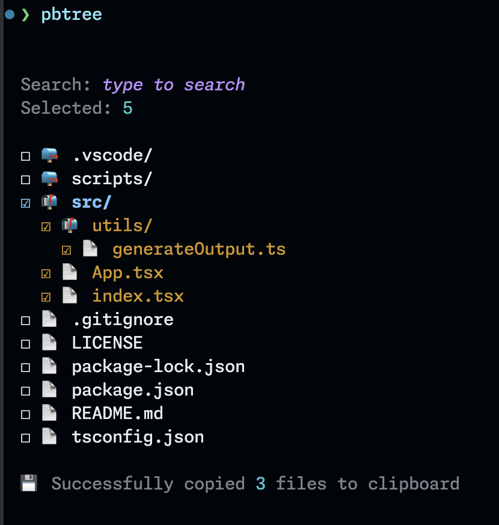

# 🌳 PBTree

PBTree is like `pbcopy`, but supercharged. 🚀



## ✨ Features

- 🖥️ Interactive file navigation
- 🔍 Quick search
- ✅ Multi-select files and folders
- 📋 Copy selected content to clipboard as XML

## 🎯 Perfect for adding context to Claude

PBTree generates XML output, making it ideal for [crafting prompts for Claude AI](https://docs.anthropic.com/en/docs/build-with-claude/prompt-engineering/use-xml-tags)! Claude loves structured data in XML tags. 🤖❤️

## 🛠️ Build & install

1. Clone the repo:
   ```bash
   git clone https://github.com/patricktrainer/pbtree.git
   cd pbtree
   ```

2. Install dependencies:
   ```bash
   npm install
   ```

3. Build the project:
   ```bash
   npm run build
   ```

4. Link the package globally:
   ```bash
   npm link
   ```

Alternatively, you can use the [rebuild script](./scripts/rebuild.js) to do all of the above:

```bash
npm run rebuild
```

## 🕹️ How to use

After building and linking, simply run `pbtree` in your terminal:

```bash
pbtree
```

- ⌨️ Type to search.
- ⬆️ ⬇️ Move up and down the list
- ⬅️ ➡️ Navigate back and forth between folders
- <kbd>space</kbd> Select or deselect the current item (file or folder)
- <kbd>⏎ return</kbd> Copy selected content to the clipboard and exit.

## 👨‍💻 Development

To run PBTree in development mode:

```bash
npm run dev
```

This uses `ts-node` to run the TypeScript files directly.

## 📦 Dependencies

- [react](https://www.npmjs.com/package/react) and [ink](https://www.npmjs.com/package/ink) for the CLI interface
- [clipboardy](https://www.npmjs.com/package/clipboardy) for clipboard operations

Check `package.json` for the full list of dependencies and their versions.

## 🤝 Contribute

Contributions welcome! 🎉

1. Fork the repo
2. Create your feature branch: `git checkout -b my-new-feature`
3. Commit your changes: `git commit -am 'Add some feature'`
4. Push to the branch: `git push origin my-new-feature`
5. Submit a pull request

🪂 **Enjoy!**